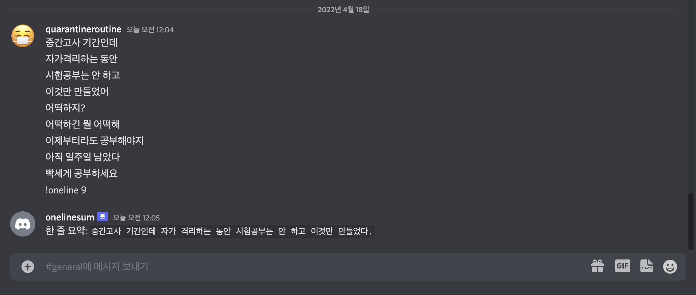

# onelinesum
디스코드 메시지 한 줄 요약 봇



## Quickstart
실행 전, 디스코드 봇 토큰을 발급 받아 `.env` 파일에 `DISCORD_BOT_TOKEN=...` 형태로 넣어야 함
```bash
pip install -r requirements.txt
python3 bot.py
```
디스코드 서버에 봇 등록 후 `!oneline <현재 메시지로부터 한줄 요약하기 위해 불러올 메시지 수>`로 실행 가능